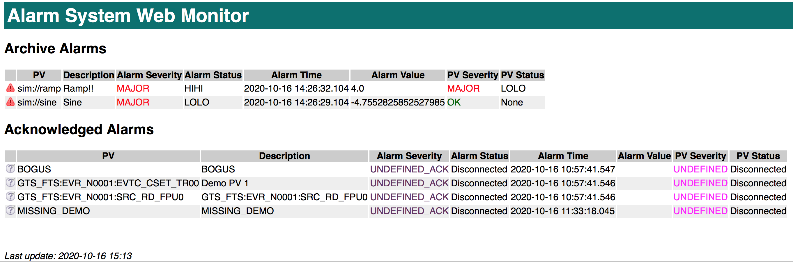

Alarm System Web Monitor
========================

A simple read-only display of current alarms, similar to the Phoebus alarm table view.

Building
--------

Build with Maven:

   mvn clean package

Develop in Eclipse via File, Import, Maven, Existing Maven Projects.

Running under Tomcat
--------------------

Set the following environment variables, for example in `$CATALINA_HOME/bin/setenv.sh` or `tomcat.conf`, depending on version and installation details:

 * `ALARM_SERVER`: Kafka server host and port, defaults to `localhost:9092`.
 * `ALARM_CONFIG`: Alarm configuration root, defaults to `Accelerator`.

Place `alarm-webmon.war` in `$CATALINA_HOME/webapps`.
When tomcat starts up, the console will show something like this to
verify the settings and successful connection to Kafka.

    INFO: ===========================================
    INFO: Alarm Webmon /alarm-webmon started
    INFO: ALARM_SERVER=localhost:9092
    INFO: ALARM_CONFIG=Accelerator
    INFO: ===========================================
    INFO: Reading from start of 'Accelerator'

Client URLs
-----------

`http://the_tomcat_host:8080/alarm-webmon` displays the alarm table,
updating at some slow, fixed period.

The tables can be sorted by clicking on the column header.
